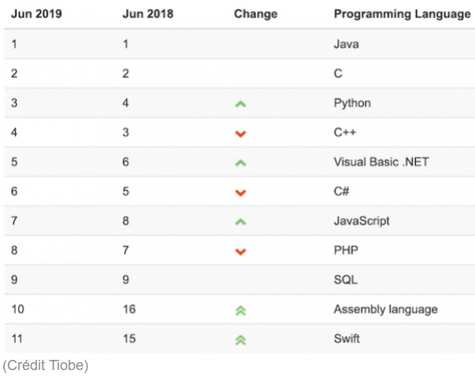
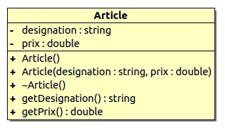

 

# TP POO : Python

- [TP POO : Python](#tp-poo--python)
  - [Le langage Python](#le-langage-python)
    - [Présentation](#présentation)
    - [Le typage](#le-typage)
  - [La syntaxe](#la-syntaxe)
  - [Interprétation de code POO](#interprétation-de-code-poo)
  - [Travaux pratiques](#travaux-pratiques)
    - [Pré-requis](#pré-requis)
    - [Travail demandé](#travail-demandé)
  - [Tests unitaires](#tests-unitaires)
  - [Bac à sable et développement en ligne](#bac-à-sable-et-développement-en-ligne)

**Les objectifs de ce TP sont de s’initier à la programmation Python en transférant ses connaissances de la programmation orientée objet.**

> Pour les enseignants, ceci est un "petit" devoir pour [Github Classroom](https://btssn-lasalle84.github.io/guides-developpement-logiciel/guide-classroom.html). Il montre l'utilisation des tests unitaires en Python, la notation automatique et l'insertion d'un badge pour l'affichage de la note.

## Le langage Python

Cette partie présente les éléments essentiels à connaître sur Python. Evidemment, cela ne remplace pas un cours ou la documentation officielle du langage.

### Présentation

Python est un langage de programmation interprété. Il permet la programmation orientée objet. Il est doté d’un typage dynamique fort, d’une gestion automatique de la mémoire par ramasse-miettes et d’un système de gestion d’exceptions.

> En 1989, profitant d’une semaine de vacances durant les fêtes de Noël, le programmeur Guido van Rossum utilise son ordinateur personnel pour écrire la première version du langage. Fan de la série télévisée Monty Python’s Flying Circus, il décide de baptiser ce projet Python. La première version publique (numéroté 0.9.0) date de février 1991. Guido van Rossum est le principal auteur de Python, et son rôle de décideur central permanent est reconnu avec humour par le titre de « Dictateur bienveillant à vie ».

Le langage Python est placé sous une licence libre et fonctionne sur la plupart des plates-formes informatiques (Windows, Unix, GNU/Linux, macOS, Android, iOS, ...).

> CPython est l’implémentation de référence du langage Python. C’est un interpréteur de _bytecode_ écrit en langage C. C’est un logiciel libre.

Python est un langage qui peut s’utiliser dans de nombreux contextes et s’adapter à tout type d’utilisation grâce à des bibliothèques spécialisées. Il est cependant particulièrement utilisé comme langage de script pour automatiser des tâches simples mais fastidieuses. Il est particulièrement répandu dans le monde scientifique, et possède de nombreuses bibliothèques optimisées destinées au calcul numérique (notamment dans la _data science_). Python est aussi utilisé comme langage de programmation dans l’enseignement élémentaire et supérieur, notamment en France.

> Le Zen de Python est un ensemble de 19 principes qui influencent le design du langage de programmation Python, et sont utiles pour comprendre et utiliser le langage : https://fr.wikipedia.org/wiki/Zen_de_Python

Ressources :

- Site officiel : https://www.python.org
- Documentation Python 3 : https://docs.python.org/fr/3/
- Documentation Python 2 : https://docs.python.org/fr/2/
- Le tutoriel Python 3 : https://docs.python.org/fr/3/tutorial/
- Le tutoriel Python 2 : https://docs.python.org/fr/2/tutorial/
- Une présentation : http://tvaira.free.fr/dev/python/cours-python.html

> Deux versions du langage Python ont longtemps cohabité : la version 2 (appelé _python legacy_) et la version 3. L’annonce de la fin de Python 2 pour le 31 décembre 2019 va définitivement accélérer le processus de migration vers la version 3.

Le langage Python est un des langages les plus populaires actuellement :



> Langages proches : Perl, Ruby, Scheme, Smalltalk et Tcl.

### Le typage

Tous les langages de programmation permettent de manipuler des valeurs avec des variables.

Le typage d’une variable consiste à associer à son nom un « type » de donnée.

> Pour rappel, le « type » est la convention d’interprétation (codage) de la séquence de bits qui constitue la variable. Le type de la variable spécifie aussi la longueur de cette séquence (8 bits, 32 bits, 64 bits, ...).

Suivant les langages de programmation, il existe plusieurs manières de considérer le typage :

- Typage statique : il consiste à demander au programmeur de déclarer expressément chaque variable en indiquant son type. Exemples de langage à typage statique : C, C++, Java, C#
- Typage dynamique : il consiste à laisser l’interpréteur réaliser cette opération de typage « à la volée » lors de l’exécution du code. C’est la valeur affectée à la variable qui précisera son type.
Exemples de langage à typage dynamique : PHP, Perl, **Python**, Javascript, bash (shell Linux)
- Typage fort : Un langage de programmation est dit fortement typé lorsqu’il garantit que les types de données employés décrivent correctement les données manipulées. Exemples de langage fortement typé : C++, Java, C#, **Python**
- Typage faible : Un langage de programmation est dit faiblement typé lorsqu’il ne considère pas comme une erreur les changements de types. Exemples de langage faiblement typé : PHP, Javascript, C (car il accepte les transtypages implicites comme par exemple `int` vers `short`)

Le langage Python est doté d’un **typage dynamique fort**.

Exemple d’utilisation des types en Python (`type.py`) :

```python
#!/usr/bin/python3
# coding: utf-8

a = 1 # un entier
b = 2.5 # un float
c = "hello" # une chaine de caracteres

# afficher le type d'une variable :
print(type(a)) # <class 'int'>
print(type(b)) # <class 'float'>
print(type(c)) # <class 'str'>

# transtypage :
a = int(b) # a vaut 2

# vérifier le type d'une variable :
print(isinstance(a, int))
```

## La syntaxe

Python utilise pour séparer les instructions : le retour chariot, les deux points (`:`)

Les blocs de code (fonctions, instructions `if`, boucles `for` ou `while` etc.) sont définis par leur indentation après les deux points (`:`).

L’indentation démarre le bloc et la désindendation le termine.

> Il n’y a donc pas d’accolades, de crochets ou de mots clés spécifiques.

## Interprétation de code POO

Soit le script Python `poo.py` :

```python
#!/usr/bin/python3
# coding: utf-8

# la première ligne (ci-dessus) commence par #! (le shebang) qui permet d'indiquer
# le chemin vers l'interpréteur avec lequel le script doit être exécuté

# Python utilise le retour chariot pour séparer les instructions, deux points (:) et l’indentation pour séparer les blocs de code.
# Les blocs de code (fonctions, instructions if, boucles for ou while etc.) sont définis par leur indentation. 
# L'indentation démarre le bloc et la désindendation le termine. 
# Il n’y a pas d’accolades, de crochets ou de mots clés spécifiques.

# Typage : dynamique, fort

class Vehicule:
    """La classe Vehicule"""
    _modele = ""
    couleur = ""

    def __init__(self, modele="", couleur=""):
        self._modele = modele
        self.couleur = couleur
    
    def affiche(self): 
        print("modele = " + self._modele)
        print("couleur = " + self.couleur)

v1 = Vehicule()

print("Vehicule v1")
v1.affiche()

v1.couleur = "rouge"
#v1.couleur = 1 # typage fort !
print("La couleur du vehicule v1 est " + v1.couleur)
v1.modele = "renault"

print("Vehicule v1")
v1.affiche()

v2 = Vehicule("peugeot", "blanche")

print("Vehicule v2")
v2.affiche()
```

Question 1. Qu’est-ce que `Vehicule` ?

Question 2. Qu’est-ce que `v1` ?

Question 3. Qu’est-ce que `couleur` ?

Question 4. Qu’est-ce que `affiche()` ?

Question 5. Qu’est-ce que fait `affiche()` ?

Question 6. Qu’est-ce que `__init__` ?

> A compléter dans le fichier `compte-rendu.md` (au format [Markdown](https://guides.github.com/features/mastering-markdown/)) fourni.

## Travaux pratiques

### Pré-requis

Programmer en Python sous Ubuntu : https://doc.ubuntu-fr.org/python

Version de Python :

```sh
$ python3 --version
Python 3.6.8
```

Il est possible de programmer directement dans l’interpréteur Python en mode CLI :

```sh
$ python
Python 2.7.15+ (default, Oct 72019, 17:39:04)
[GCC 7.4.0] on linux2
Type "help", "copyright", "credits" or "license" for more information.
>>> a = 1
>>> print a
1
>>> exit()
```

Le script Python `helloworld3.py` :

```python
#!/usr/bin/python3
# coding: utf-8

# un commentaire : mon premier programme Python !

import sys

print(sys.version)
print()

# saisie d'une chaîne de caractères
langue = input("Quelle est votre langue ? (fr, ...)")

# une instruction conditionnelle
if langue == "fr" :
    message = "Bonjour le monde"
else :
    message = "Hello world"

# voir aussi : if ... elif ... else

# saisie d'un entier
nb = int(input("Donnez un nombre : "))
i = 0

# une boucle
while i < nb:
    #print(message)
    print(message, i + 1, " fois")
    i += 1

```

> La première ligne sert à préciser le chemin de l’interpréteur précédé des caractères `#!` (le _shebang_) qui exécutera le script. Cette ligne est inutile dans le cas d’une programmation web.

Il existe plusieurs manières d’exécuter un script Python de façon locale (mode CLI) :

- le rendre exécutable :

```sh
$ chmod +x helloworld3.py
$ ./helloworld3.py
```

- utiliser l’interpréteur Python :

```sh
$ python3 helloworld3.py
```

### Travail demandé

Pour l’écriture d’un programme orientée objet en Python, on désire disposer du concept d’`Article`.

Notre article doit posséder une designation et un prix. Il est possible d’obtenir la designation et le prix d’un article. Lorsque l’on crée un article, il est possible de préciser sa designation et son prix sinon il aura des valeurs nulles par défaut.



Fournir un programme `article.py` qui permet de répondre aux questions suivantes :

Question 7. Implémenter la classe `Article`.

Question 8. Instancier un objet `article1` en utilisant le constructeur par défaut et un objet `article2` dont la désignation est "Le Trône de fer, Tome 1" avec un prix de 13.29 euros.

Question 9. Donner l’instruction qui permet d’afficher simplement le prix de l'`article2`.

Question 10. Ajouter une méthode `affiche()` qui affichera la designation et le prix de l’`Article` sous la forme "<designation> : <prix> euros", par exemple : "Le Trône de fer, Tome 1 : 13.29 euros". Afficher l'`article2` avec la méthode `affiche()`.

_Bonus :_ Afficher l’aide (_docstring_) sur la méthode `affiche()`.

## Tests unitaires

Installation :

```sh
$ sudo apt -y install python3-pip
$ sudo -H pip3 install pytest
```

Lancement des tests :

```sh
$ pytest article1_test.py
$ pytest article2_test.py
$ pytest article3_test.py
```sh

## Bac à sable et développement en ligne

Il est souvent nécessaire de passer par un "bac à sable".

> En informatique, le bac à sable (_sandbox_) est une zone d'essai permettant d'exécuter des programmes en phase de test ou dans lesquels la confiance est incertaine. C'est notamment très utilisé en sécurité informatique pour sa notion d'isolation.

Il existe de nombreux sites web qui fournissent des EDI (Environnement de Développement Intégré) en ligne pour tester du code ou des services : un espace d'apprentissage séparé. Ils permettent aussi d'échanger des exemples.

Quelques sites :

- JSFiddle : https://jsfiddle.net/ pour HTML, CSS et JavaScript
- Codeply : https://www.codeply.com/ pour les frameworks JavaScript
- Coding Ground For Developers : https://www.tutorialspoint.com/codingground.htm pour tout !
    - PHP : https://www.tutorialspoint.com/execute_php_online.php
    - **Python : https://www.tutorialspoint.com/execute_python3_online.php**
    - Markdown : https://www.tutorialspoint.com/online_markdown_editor.php
- Visual Studio Code Online : https://vscode.dev/
- Gitpod : https://www.gitpod.io/
- Codeanywhere (Cloud IDE) : https://codeanywhere.com/

Exercices d’entraînement : http://tvaira.free.fr/dev/python/exercices-python.html

---
Thierry Vaira : **[thierry(dot)vaira(at)gmail(dot)com](thierry.vaira@gmail.com)**
